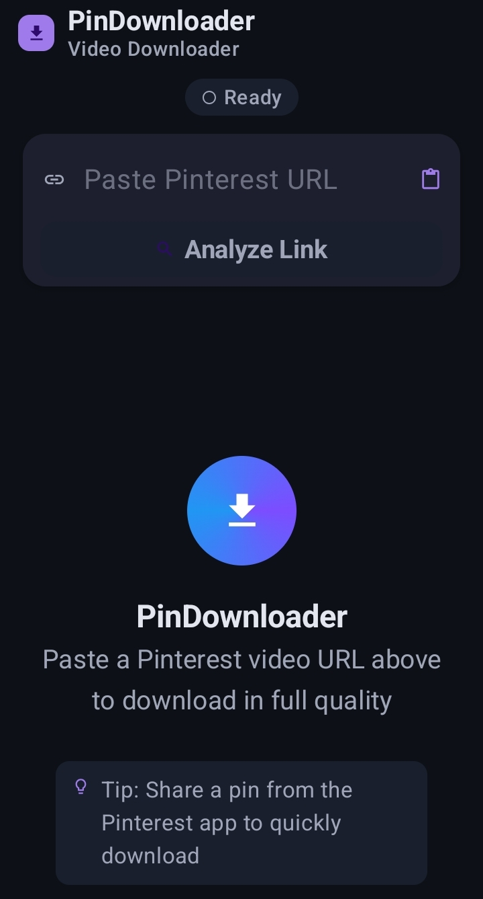
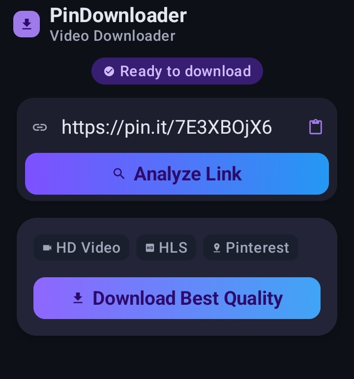
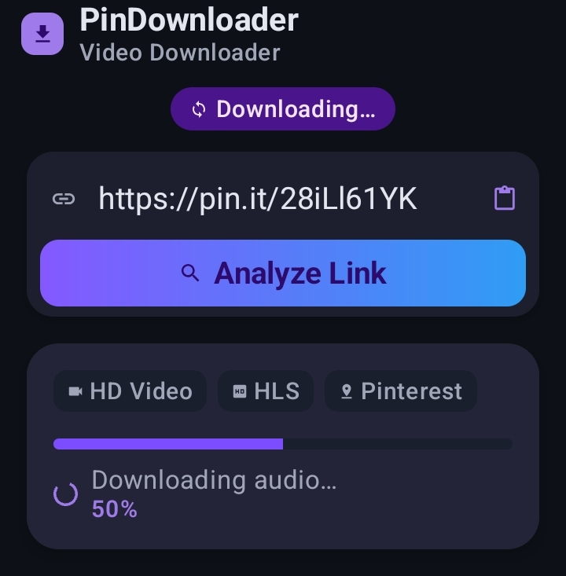
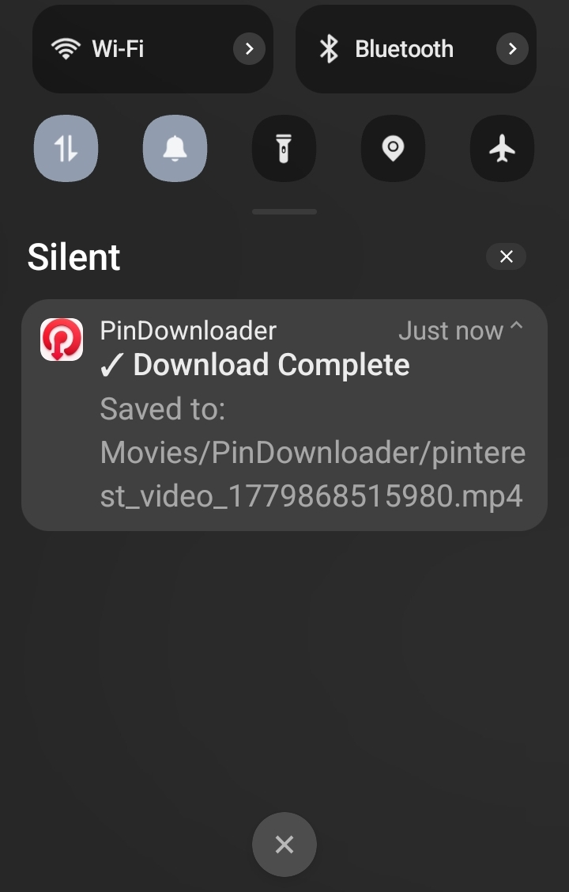

# PinDownloader

Android downloader app with share intent support — download Pinterest videos directly to your device.

## Features

- Download videos by pasting or sharing a Pinterest pin URL
- Automatic highest quality selection
- Video and audio merged into a single MP4 file
- Downloads saved to Gallery (`Movies/PinDownloader/`)
- Share intent support — share a pin from the Pinterest app
- Dark mode support
- Material 3 design
- No ads, no tracking, no accounts required

## Screenshots

<table>
  <tr>
    <td align="center">
      
      <br />
      <sub>Home screen</sub>
    </td>
    <td align="center">
      
      <br />
      <sub>Ready to download</sub>
    </td>
  </tr>
  <tr>
    <td align="center">
      
      <br />
      <sub>Downloading progress</sub>
    </td>
    <td align="center">
      
      <br />
      <sub>Download complete</sub>
    </td>
  </tr>
</table>

## Build Instructions

```bash
# Clone the repository
git clone https://github.com/aman179102/pin-downloader.git

# Open in Android Studio or build via CLI
cd pin-downloader
chmod +x ./gradlew
./gradlew assembleDebug
```

The debug APK will be at `app/build/outputs/apk/debug/app-debug.apk`.

## Install APK

1. Enable "Install from unknown sources" on your device
2. Transfer the APK or download it from GitHub Releases
3. Open the APK file and follow the prompts

## Privacy

This app does **not** collect any data, show any ads, or use any tracking.
All URL processing happens on your device.
See [PRIVACY.md](PRIVACY.md) for full details.

## Disclaimer

This app is not affiliated with, endorsed by, or associated with Pinterest or any other third-party service. Users are responsible for downloading only content they own or have permission to download.

## F-Droid Readiness

This repository includes metadata files for F-Droid / IzzyOnDroid submission:
- `fdroid/metadata-template.yml` — template for [fdroiddata](https://gitlab.com/fdroid/fdroiddata)
- `fastlane/` — store listing metadata

## License

This project is licensed under the **GNU General Public License v3.0**.
See the [LICENSE](LICENSE) file for details.
